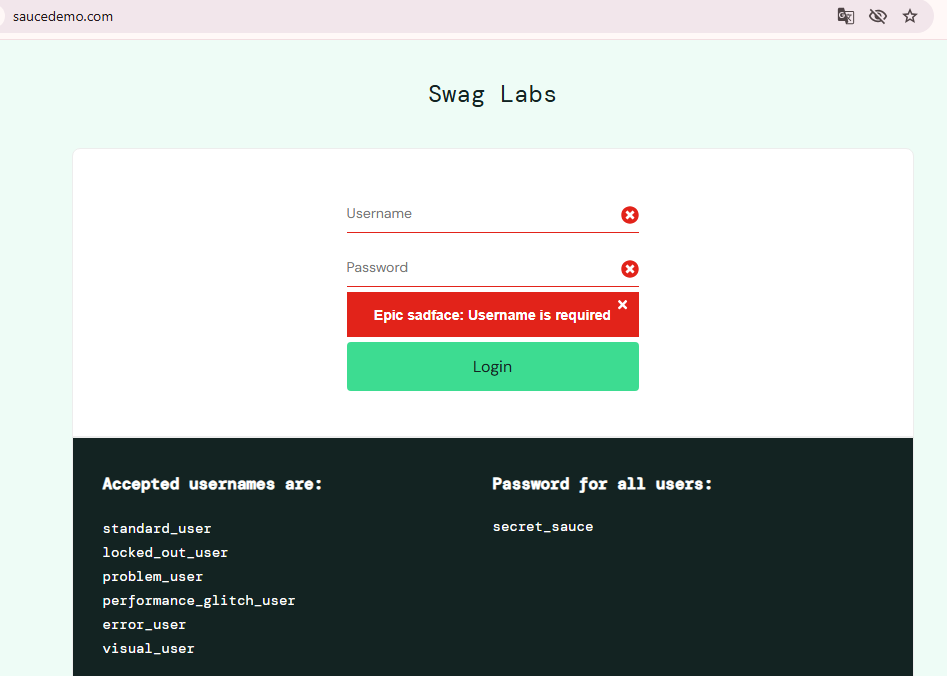
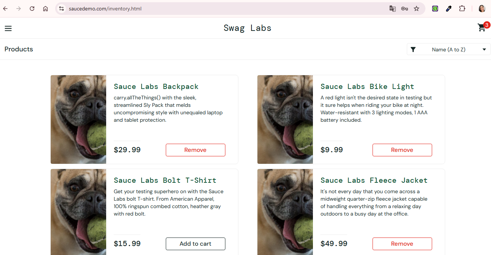
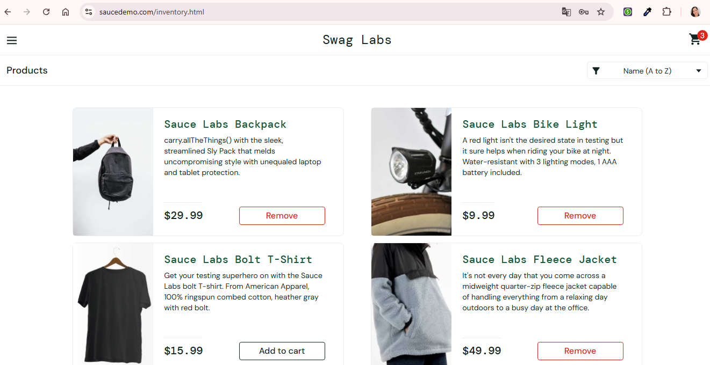
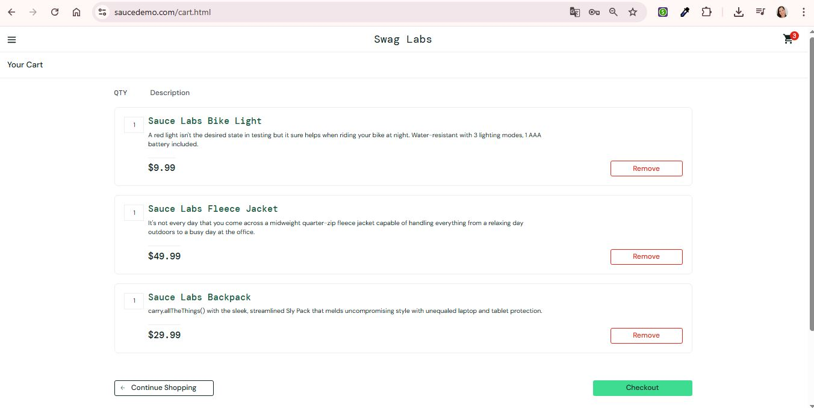

# 🐞 Relatório de Bugs

---

## BUG-001 – Validação incompleta de campos obrigatórios no login

**Relacionado ao caso de teste:** CT-03 – Login com campos vazios  

**Ambiente:**
- Aplicação: SauceDemo  
- URL: https://www.saucedemo.com/  
- Navegador: Chrome  
- Data do teste: 22/04/2026  

**Módulo:** Login  
**Severidade:** Média    
**Prioridade:** Média  
**Tipo de defeito:** Validação / UX

### Passos para reprodução:
1. Acessar a página de login
2. Não preencher os campos de usuário e senha
3. Clicar no botão "Login"

### ❌ Resultado atual:
Mensagem exibida:  
"Epic sadface: Username is required"

### ✅ Resultado esperado:
Sistema deve informar que ambos os campos (usuário e senha) são obrigatórios.

### Impacto:
Usuário pode não compreender que ambos os campos são obrigatórios, comprometendo a interação com o sistema.

### Evidência:

### Observação:
A validação ocorre apenas para o campo de usuário, ignorando o campo de senha quando ambos estão vazios.

---

## BUG-002 – Imagens dos produtos exibidas incorretamente

**Relacionado ao caso de teste:** CT-05 – Fluxo de produtos com problem_user
**Usuário impactado:** problem_user

**Ambiente:**
- Aplicação: SauceDemo  
- URL: https://www.saucedemo.com/  
- Navegador: Chrome  
- Data do teste: 25/04/2026
  
**Módulo:** Produtos  
**Escopo afetado:** Listagem de produtos  
**Severidade:** Média  
**Prioridade:** Alta  
**Tipo de defeito:** Funcional / UI  

### Passos para reprodução:
1. Acessar a página de login
2. Inserir o usuário `problem_user`
3. Inserir a senha `secret_sauce`
4. Clicar no botão "Login"
5. Acessar a lista de produtos

### ❌ Resultado atual:
Imagens exibidas na listagem estão repetidas ou não correspondem aos produtos descritos.

### ✅ Resultado esperado:
Cada produto deve exibir a imagem correta correspondente à sua descrição.

### Impacto:
Usuário pode perder confiança na aplicação e tomar decisões incorretas de compra devido à inconsistência visual dos produtos.

### Evidência:
- Tela de produtos com imagens incorretas:

- Tela do produto correto:

### Observação:
O problema ocorre apenas na listagem. Ao acessar o detalhe do produto, a imagem correta é exibida.

---

---

## BUG-003 – Ausência de funcionalidade para seleção de quantidade do produto

**Relacionado ao caso de teste:** CT-05 – Fluxo de produtos com problem_user  
**Usuário impactado:** problem_user  

**Ambiente:**
- Aplicação: SauceDemo  
- URL: https://www.saucedemo.com/  
- Navegador: Chrome  
- Data do teste: 25/04/2026  

**Módulo:** Carrinho / Produtos  
**Escopo afetado:** Detalhe do produto e carrinho de compras  
**Severidade:** Média  
**Prioridade:** Alta  
**Tipo de defeito:** Funcional / UX / Possível melhoria  

---

### Passos para reprodução:
1. Acessar a página de login  
2. Inserir o usuário `problem_user`  
3. Inserir a senha `secret_sauce`  
4. Clicar no botão "Login"  
5. Acessar a lista de produtos  
6. Selecionar um produto  
7. Verificar a presença de controle de quantidade  
8. Adicionar o produto ao carrinho  
9. Acessar o carrinho e verificar possibilidade de edição da quantidade  

---

### ❌ Resultado atual:
Não há controle disponível para seleção de quantidade.  
Tanto na página de detalhe quanto no carrinho, os itens são adicionados com quantidade fixa de 1 unidade, sem possibilidade de edição.

---

### ✅ Resultado esperado:
O sistema deve permitir ao usuário selecionar a quantidade desejada do produto (ex: campo numérico, seletor ou botão de incremento/decremento), tanto antes de adicionar ao carrinho quanto dentro do carrinho.

---

### Impacto:
Usuário fica impossibilitado de adquirir múltiplas unidades do mesmo produto, limitando a experiência de compra e podendo impactar negativamente a conversão de vendas.

---

### Evidência:

---

### Observação:
A ausência de controle de quantidade pode representar uma limitação funcional do sistema e não necessariamente um erro.  
Recomenda-se validação com os requisitos de negócio para confirmar se o comportamento é esperado ou se configura uma melhoria.
